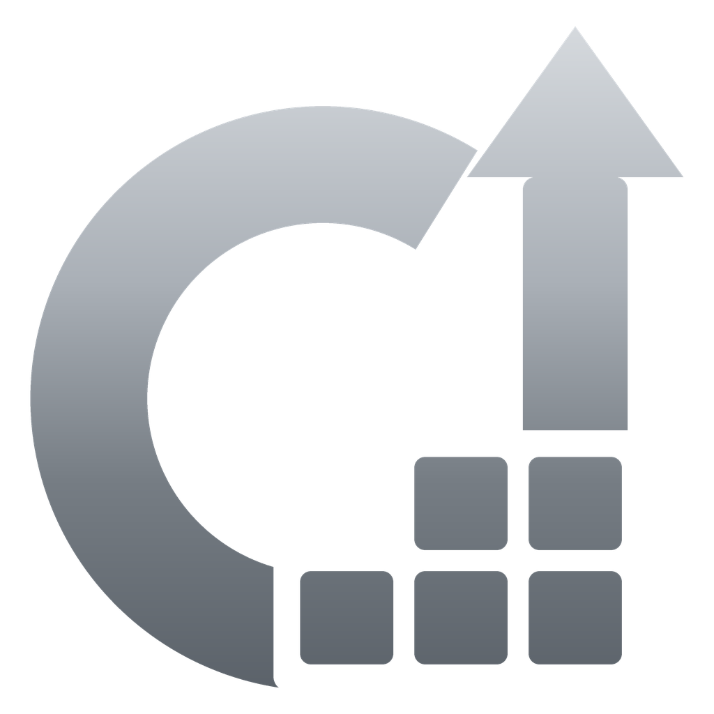
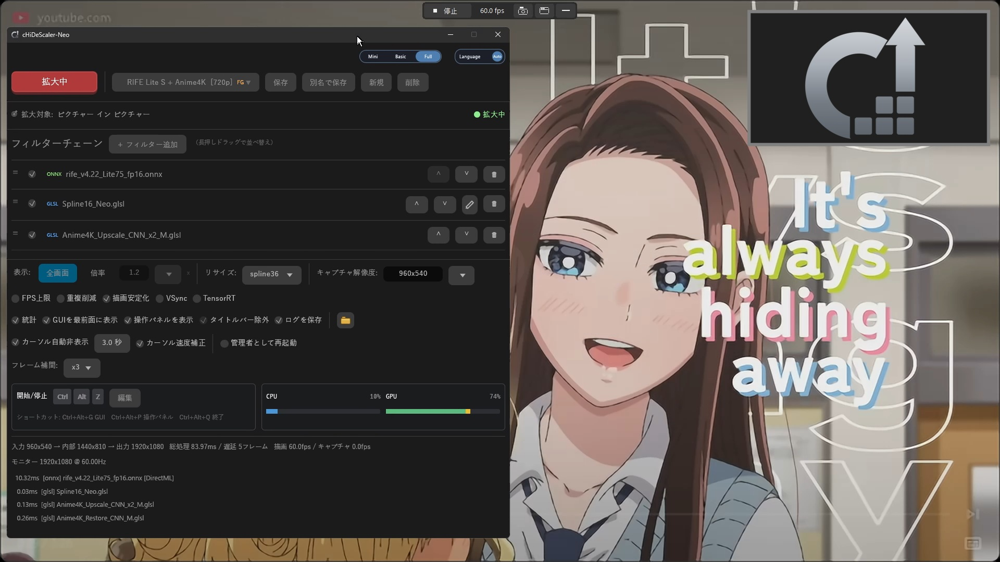

<p align="center">
  
</p>

<details>
<summary>English</summary>

# cHiDeScaler-Neo

**AI Upscaler & Frame Interpolator for Windows**

cHiDeScaler-Neo captures a Windows application window and applies real-time GLSL / ONNX video processing.

## Features

* Windows Graphics Capture (WGC)
* GLSL / ONNX filter chains and presets
* User-addable ONNX models and mpv-compatible GLSL shaders
* DirectML ONNX backend
* Optional TensorRT backend for GeForce RTX 20 / 30 / 40 / 50 Series
* RIFE / DRBA frame interpolation (x2–x5)
* FPS limit / duplicate-frame reduction
* Draw Stabilization / VSync / capture-resolution controls
* Multi-language GUI and portable configuration

The bundled `presets.json`, GLSL shaders, and ONNX models are kept together so the included presets can resolve their required files.

**HDR is not supported.** cHiDeScaler-Neo is designed for SDR video processing and output.

## :clapper: Introduction Video (YouTube)

[](https://youtu.be/eABc_mNLxIA)

## Build

Requirements:

* Windows 10 / 11 (64-bit)
* Rust toolchain with `cargo`
* MSVC-compatible Windows build tools

```bat
cargo build --release --bin chidescaler-neo
```

The standard DirectML runtime files are included under `backends/`. TensorRT is an optional separate backend pack; see [`backends/tensorrt/README.md`](backends/tensorrt/README.md).

## Acknowledgements / Reference Projects

* [Magpie (Blinue)](https://github.com/Blinue/Magpie)
* [mpv_PlayKit (hooke007)](https://github.com/hooke007/mpv_PlayKit)
* [mpv-AnimeJaNai (the-database)](https://github.com/the-database/mpv-AnimeJaNai)
* [vs_temporalfix (pifroggi)](https://github.com/pifroggi/vs_temporalfix)
* [Anime4K (bloc97)](https://github.com/bloc97/Anime4K)
* [OpenModelDB](https://openmodeldb.info/)

Source / license information for some bundled third-party models and shaders is still being organized and will be added as it is confirmed. See [`THIRD_PARTY_NOTICES.md`](THIRD_PARTY_NOTICES.md).

## Disclaimer

This software is an independently developed personal project. Please use it at your own discretion and responsibility.

The author cannot be held responsible for any malfunction, damage, trouble, or other issue arising from the installation, configuration, or use of this software.

</details>

# cHiDeScaler-Neo

**Windows用 AI アップスケーラー & フレーム補間**

cHiDeScaler-Neo は、PC上の任意のウィンドウをリアルタイムにキャプチャし、GLSL / ONNXによる映像処理を適用して拡大表示するWindows用ポータブルアプリケーションです。

## 主な機能

* Windows Graphics Capture（WGC）
* GLSL / ONNXフィルターチェーンとプリセット
* ユーザーによるONNXモデル / mpv互換GLSLシェーダーの追加
* DirectML ONNXバックエンド
* GeForce RTX 20 / 30 / 40 / 50シリーズ向けオプションTensorRTバックエンド
* RIFE / DRBA フレーム補間（x2～x5）
* FPS上限 / 重複フレーム削減
* 描画安定化 / VSync / キャプチャ解像度設定
* 多言語GUI / ポータブル設定

同梱 `presets.json` から必要なファイルを参照できるよう、現在使用しているGLSLシェーダー / ONNXモデルは同じ構成で維持しています。

**HDRには対応していません。** cHiDeScaler-Neo はSDR映像の処理・出力を前提としています。

:clapper:紹介動画（YouTube）
---
[](https://youtu.be/eABc_mNLxIA)

## ビルド

必要環境：

* Windows 10 / 11 (64-bit)
* `cargo` を含むRustツールチェーン
* MSVC互換のWindowsビルドツール

```bat
cargo build --release --bin chidescaler-neo
```

標準のDirectML動作に必要なランタイムは `backends/` に同梱しています。TensorRTは別途追加するオプションバックエンドです。詳細は [`backends/tensorrt/README.md`](backends/tensorrt/README.md) を参照してください。

## 参考プロジェクト / 謝辞

* [Magpie (Blinue)](https://github.com/Blinue/Magpie)
* [mpv_PlayKit (hooke007)](https://github.com/hooke007/mpv_PlayKit)
* [mpv-AnimeJaNai (the-database)](https://github.com/the-database/mpv-AnimeJaNai)
* [vs_temporalfix (pifroggi)](https://github.com/pifroggi/vs_temporalfix)
* [Anime4K (bloc97)](https://github.com/bloc97/Anime4K)
* [OpenModelDB](https://openmodeldb.info/)

一部の外部モデル / シェーダーは、出所・ライセンス情報を現在整理中です。確認できたものから順次記載を追加します。詳細は [`THIRD_PARTY_NOTICES.md`](THIRD_PARTY_NOTICES.md) を参照してください。

## 免責事項

本ソフトウェアは個人制作によるものです。ご利用は各自の判断と責任でお願いいたします。  
本ソフトウェアの導入、設定、使用により生じたいかなる不具合、損害、トラブル等についても作者は責任を負いかねます。
